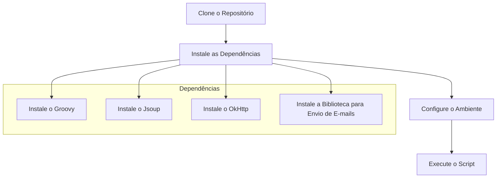

# Web Crawler

## Descrição

Este projeto desenvolve um bot (Web Crawler) para coletar dados do site da Agência Nacional de Saúde (ANS) do Governo Brasileiro. O objetivo é baixar documentos do padrão TISS (Troca de Informações na Saúde Suplementar), coletar dados históricos e baixar tabelas relacionadas. O bot é implementado em Groovy e utiliza bibliotecas como Jsoup e OkHttp para realizar requisições HTTP e fazer parsing de HTML.

## Funcionalidades

### Principais tarefas e funções:

1. **Baixar Documentos do Padrão TISS**
    - Acessa o site da ANS e navega até o campo "Espaço do Prestador de Serviços de Saúde".
    - Baixa o componente de comunicação da versão mais recente do padrão TISS.
    - Salva o arquivo em uma pasta de Downloads no diretório do projeto.

2. **Coletar Dados Históricos**
    - Acessa o campo "Histórico das versões dos Componentes do Padrão TISS".
    - Coleta dados de competência, publicação e início de vigência a partir de janeiro de 2016.
    - Armazena os dados coletados em um arquivo de texto ou CSV.

3. **Baixar Tabela de Erros**
    - Acessa o campo "Tabelas relacionadas".
    - Baixa a "Tabela de erros no envio para a ANS".
    - Salva o arquivo na pasta de Downloads.

### Funcionalidade de envio de e-mails

- **Envio de Relatório por E-mail**
    - Cria uma lista de e-mails interessados.
    - Envia um relatório simples contendo os arquivos baixados para os e-mails da lista.
    - Implementa CRUD para gerenciar a lista de e-mails interessados.

## Requisitos

- Groovy 3.x
- Jsoup
- OkHttp
- Biblioteca para envio de e-mails

## Instalação e Configuração

